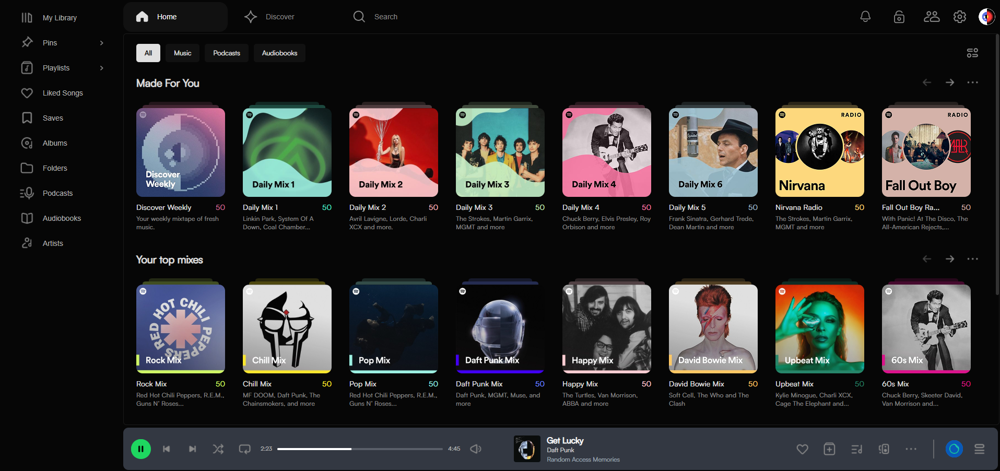

# 10x-Markup-exam---spotify

📷 Preview



📌 Project Name:

A responsive Spotify web clone built using HTML, SCSS, and modern CSS layout techniques.

🛠️ Technologies Used:

HTML5

SCSS / SASS

CSS Flexbox

CSS Grid

Git & GitHub

📁 Project Structure

```
project/
├── index.html
├── library.html
├── liked-songs.html
├── search.html
│
├── assets/
│   ├── icons/
│   └── images/
│
├── css/
│   ├── main.css
│   └── main.css.map
│
├── fonts/
│
├── scss/
│   ├── main.scss
│   │
│   ├── base/
│   │   ├── _fonts.scss
│   │   ├── _index.scss
│   │   ├── _mixins.scss
│   │   ├── _reset.scss
│   │   └── _variables.scss
│   │
│   ├── components/
│   │   ├── _card.scss
│   │   └── _filters.scss
│   │
│   └── layout/
│       ├── _header.scss
│       ├── _layout.scss
│       ├── _liked-songs.scss
│       ├── _mainsection.scss
│       ├── _player.scss
│       ├── _responsive.scss
│       ├── _sidebar.scss
│       └── _toggledbar.scss
│
└── README.md
```

📱 Responsive Design:

Desktop

Mobile

⚙️ Installation:

git clone https://github.com/Pirvela/10x-Markup-exam---spotify.git

cd 10x-Markup-exam---spotify

👨‍💻 Authors:

- Mariam Vardosanidze
- Nika Karsidze
- Nodar Pirveli

GitHub:

- https://github.com/mvardosanidze50-cyber
- https://github.com/ImmortalFae
- https://github.com/Pirvela

🤝 Team Contributions:

### Mariam Vardosanidze

- Implemented and styled the **Sidebar navigation**
- Worked on **Liked Songs page layout**
- Implemented **SCSS structure (variables and mixins usage)**
- Fixed layout and spacing issues based on Figma design

### Nika Karsidze

- Header / Navigation Bar
- Built and styled the main header section using HTML and CSS.
- Created and styled the search page interface.
- Implemented layout and visual components to match the Spotify design.
- Friends Activity Sidebar
- Implemented JavaScript functionality to toggle the sidebar visibility when - - clicking the icon.
- Theme Toggle (White Theme)

### Nodar Pirveli

- The SCSS architecture follows the 7–1 pattern.
- Created separate files for variables resets and mixins to keep the styles modular and maintainable.
- Built the basic project skeleton / structure.
- Worked on the middle content section of the main page.
- Built the My Library page layout.
- Implemented mobile responsive design for all pages.
